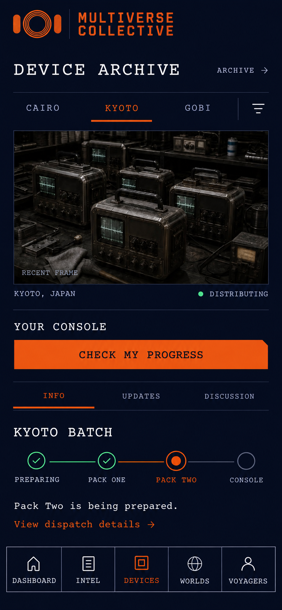
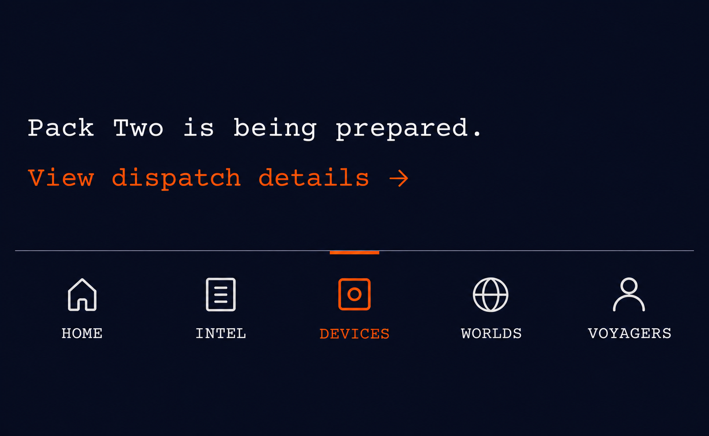
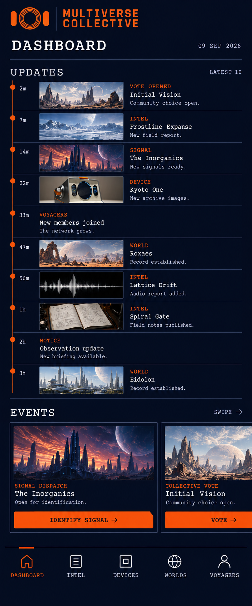
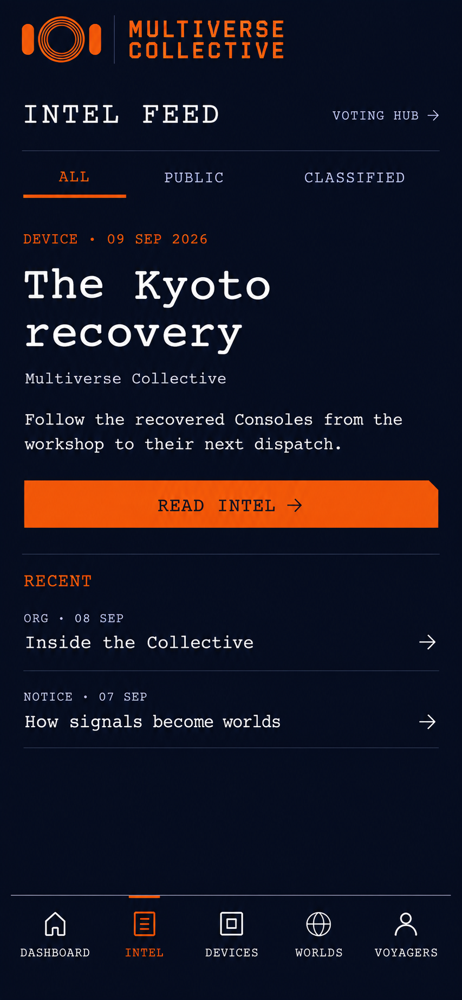
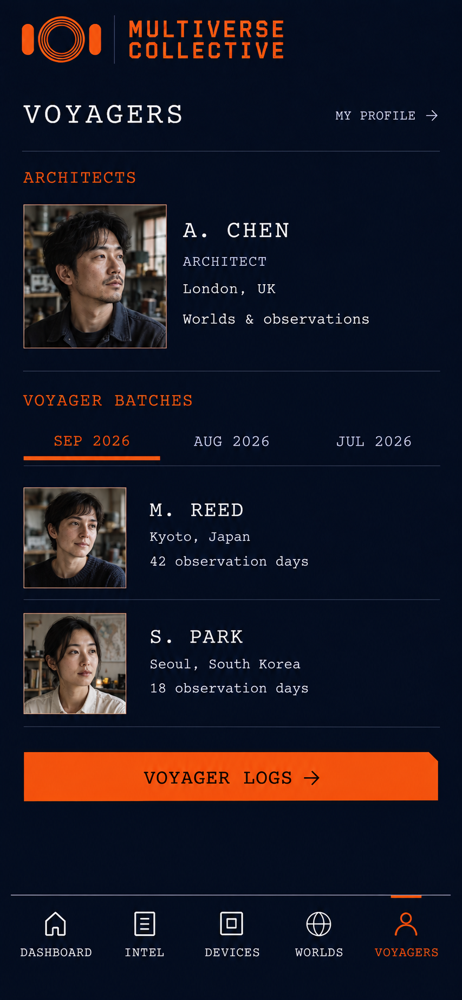

# 已选视觉参考与使用边界

> **2026-09-10 最新展示规则：游客与登录态头部互斥。** 游客显示原三个数字指标，登录后统一显示 WELCOME, VOYAGER 欢迎与个人身份状态（实际身份在角色标签显示）；两块不叠加。内容区不重复放品牌 Logo；恢复桌面/横屏统一侧栏中的原品牌、导航和账号区域。Intel 列表、新闻详情及 Updates 中的新闻条目保留作者头像（紧邻昵称）和图片。Updates 的类型/有效期暂不改变，当前口径见实现说明。

**2.3 更新 · 2026-09-09：一级 Tab 页面可以保留 Logo，五页采用统一的克制品牌区；Voyager Logs 等二级及更深页面不显示 Logo。纠正 2.2 将所有一级页品牌块一律作废的说明。原图未重绘；2026-09-10 补充：一级页不显示重复 Tab 名称，旧图中的五个 Tab 大标题不作为实施依据。品牌区尺寸、留白与页面标题按最新规范执行，资产本身不变。**

本目录是 [UI 规范](../../design-system.md) 的视觉参考包。原图按字节复制，未编辑。来源与 SHA-256 见 [manifest.json](manifest.json)。效果图是构图依据，不是生产截图或像素级资产库。

## 1. 参考优先级

| 参考 | 负责的设计决定 | 不应照抄的部分 |
| --- | --- | --- |
| [Devices 原始第二款](devices-style.png) | 整体档案气质、留白、媒体/文字关系 | 品牌区旧尺寸与过量留白、旧底栏围框、图内设备/文本示例、细小字形误差 |
| [Quiet Rail 第一款](quiet-rail.png) | 底栏轻顶线、短橙标记、无围框/竖分隔 | 旧 HOME 标签必须改 DASHBOARD，图标统一真实图标库 |
| [Devices 组合稿](devices-selected-nav.png) | 整体风格与细线底栏的组合 | 品牌区尺寸须校准、HOME 已作废；图标需校准，旧产品外形不定义新型号 |
| [Dashboard 正式结构稿](dashboard-updates-events.png) | Updates 10 条时间轴 + Events 横轨；无 My Profile | 品牌区旧尺寸与过量留白、被压缩的图文尺寸、CTA 渐变误差、示例数据 |
| [Intel 延展稿](intel.png) | 筛选、重点内容与轻列表层级 | 品牌区旧尺寸与过量留白、示例正文、字形与字号 |
| [Voyagers 延展稿](voyagers.png) | 成员重点内容、批次筛选、列表和个人资料归属 | 品牌区旧尺寸与过量留白、虚构成员肖像/姓名 |

主规则高于图片：原始 logo 不变、颜色取规范变量、Courier Prime、字号至少 12px、触控至少 44px、手机竖屏优先。不能从生成图重新取色、截取 logo 或把生成图误差写入组件。

规则状态详见 [导航与交互合同](../interaction-contracts.md)：已选方向、实施默认值、视觉提案与已验证代码分开登记。图中符合已批准合同的行为有依据，但图片不等于可交互 UI Kit。

## 2. 整体风格

## 3. 底栏

正式名称固定为 DASHBOARD / INTEL / DEVICES / WORLDS / VOYAGERS。图片中若出现 HOME，以本条更正。只保留轻顶线和当前项的短橙线。

## 4. Dashboard 正式结构

这是一张全页长图，不要求把十条动态装进一个手机视口。实现基准在 [组件说明 C11/C12](../ui-components.md)：390px 宽时缩略图 120×64，文字真实渲染，页面纵滚、Events 横滚、底栏固定在视口底部。

图中 8 条有图 + 2 条纯文是示例组合，不是数据配额。主按钮采用纯橙底与深蓝文字；图内渐变不采用。My Profile 归 Voyagers。

## 5. Intel 与 Voyagers

## 6. 已被取代的设计

- 二级及更深页面重复的 Multiverse Collective 图形/文字 logo 页头，以及移除后仍保留的大块空白；一级品牌区本身没有作废。
- 任何把第一主入口标成 HOME 的稿。
- 底栏带完整围框、竖分隔、选中大色块或凸起中心入口的方案。
- Dashboard 的 My Profile、头像资料快捷入口或个人资料面板。
- Dashboard 的双列 Actions/Events 网格。
- 把所有卡片、输入、图片都切角的重复装饰。
- 以生成图的 logo、字体或小字尺寸替代真实品牌资源。

历史探索保留在 output 中用于追溯；本目录只集中本次说明需要的参考，不改变其他任务和原图。
