# 设备造型与平行世界屏幕素材

面向开发者、视觉设计师与视频制作的参考库。包含 **3 张产品原图、6 张辅助造型图、4 张世界屏幕效果图、3 张仓库右屏修正版及 1 张右屏 UI 母版**。生成时间：2026-09-09。

> 结构以原图为准。AI 辅助图用于视角、光照和视觉沟通，不是 CAD、工程尺寸图或准确的 UI 规范。此前顶部错误和多机堆叠中的变形图不纳入本库。

[生成前必读：图片模式、素材来源与确认流程](image-generation-spec.zh.md)

[本次右屏逐图审核与仓库修正版](right-screen-review.md)

## 使用规范

1. 最新款原图 01 决定机身比例、材质和正面布局；原图 02、03 补充另一侧、背面和顶部。右屏图形改以 `ui-reference/right-screen-optic-master.png` 为准，原始产品图中模糊的右屏不再作为 UI 依据。
2. 机身为向后收低的楔形，保持前面板斜度、银框和宽前下沿；顶部橙色件为薄片结构，不能改成方块或把顶部拉平。
3. 固定中央圆屏、两侧竖向胶囊屏、银色齿纹旋钮及橙色横件的位置与比例。
4. 每次生成都附原图；辅助图只提供相近机位和光照。不要反复以新生成图代替原图作为唯一参照。
5. 新版本保留原文件并单独编号；多台设备须逐台核对轮廓和遮挡关系。

[查看宣传图与视频制作流程](production-workflow.zh.md) · [素材清单、完整提示词和 SHA-256](manifest.json)

## 原始结构依据

### 最新款左前视图

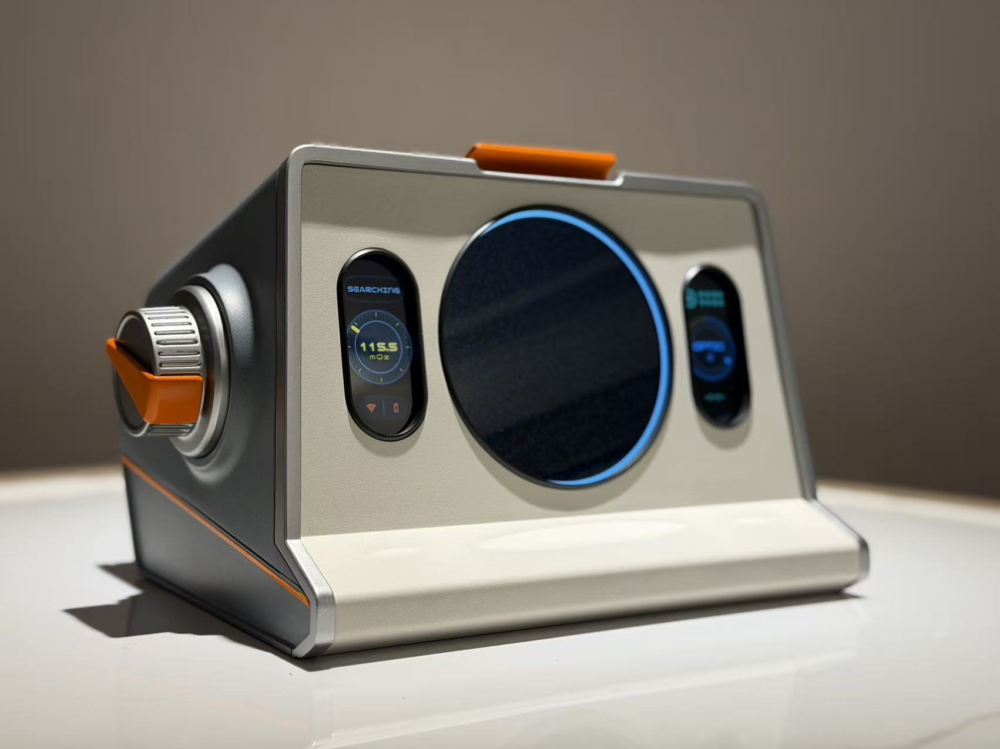

### 右前原始渲染

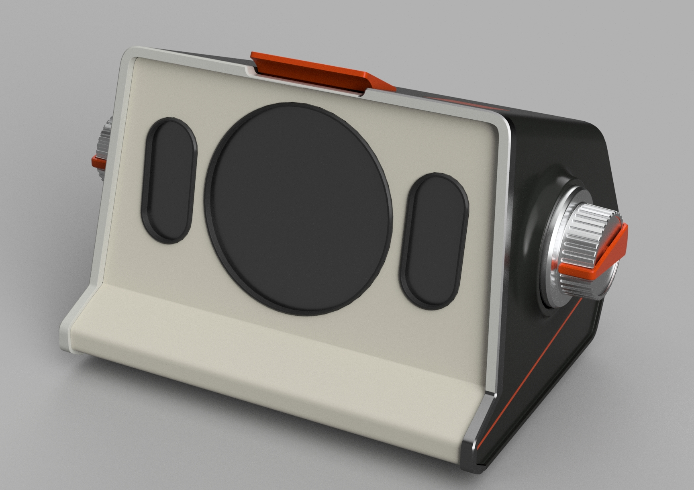

### 背面与顶部原始渲染

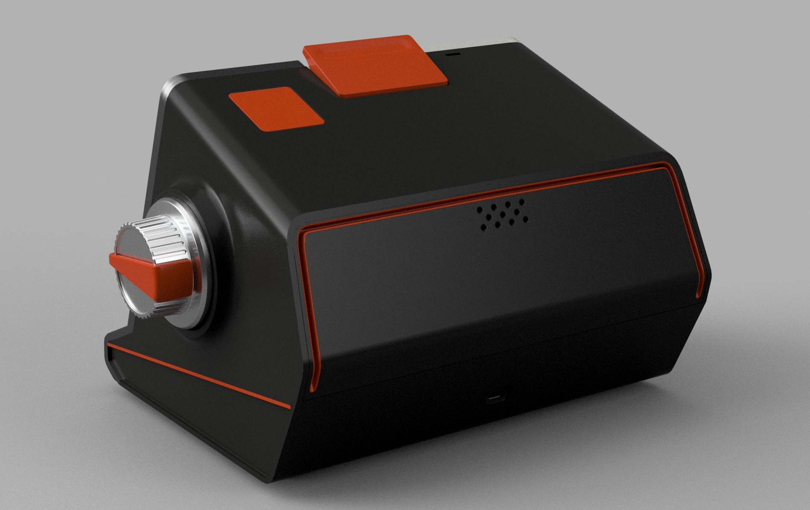

## 基础视角与光照辅助图

顶部修正版减少了俯视面积，不能用于推导完整顶部的准确坡度；顶部细节请结合原始背视图核对。

### 正面 · 中性柔光

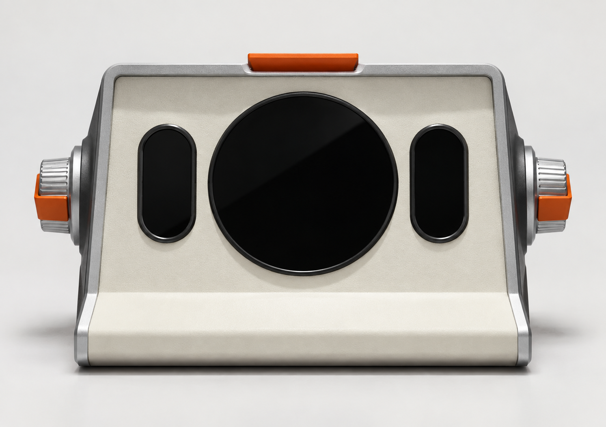

### 左前侧 · 柔和日光

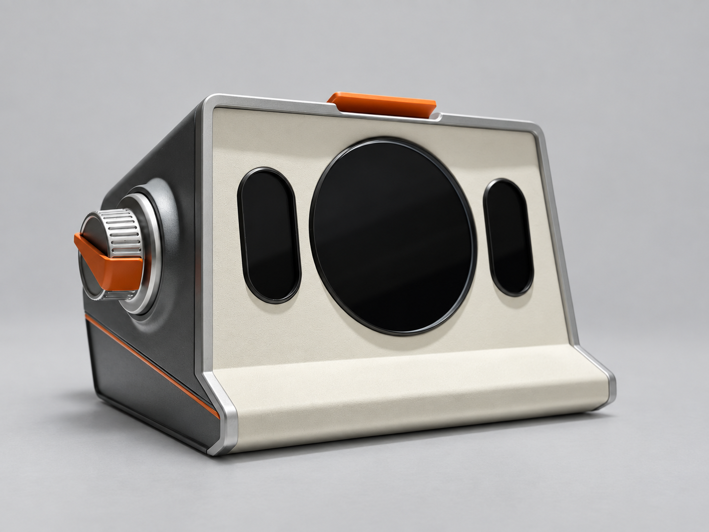

### 右前侧 · 柔和日光

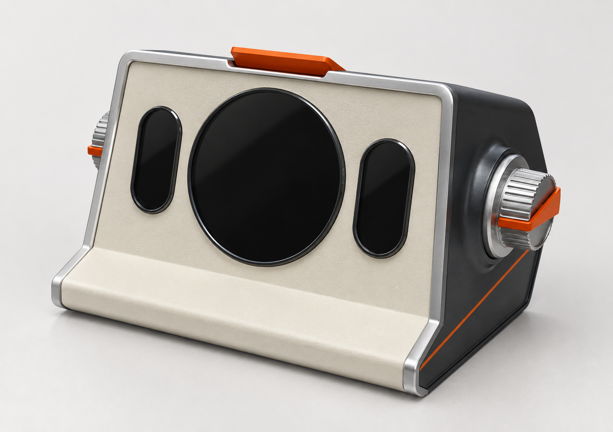

### 后侧 · 背部结构

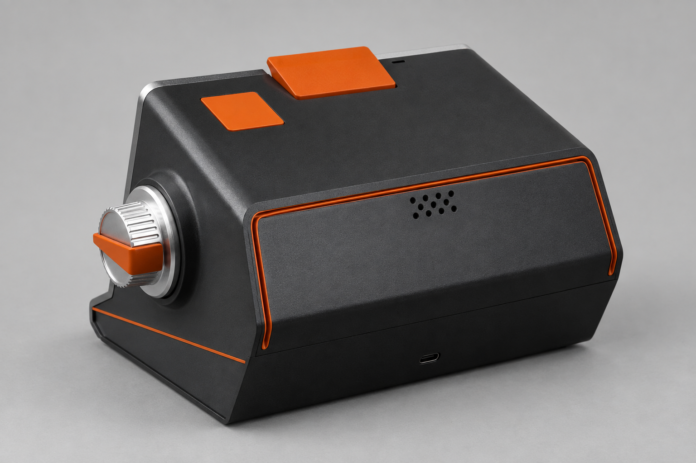

### 左前侧 · 暖色侧光

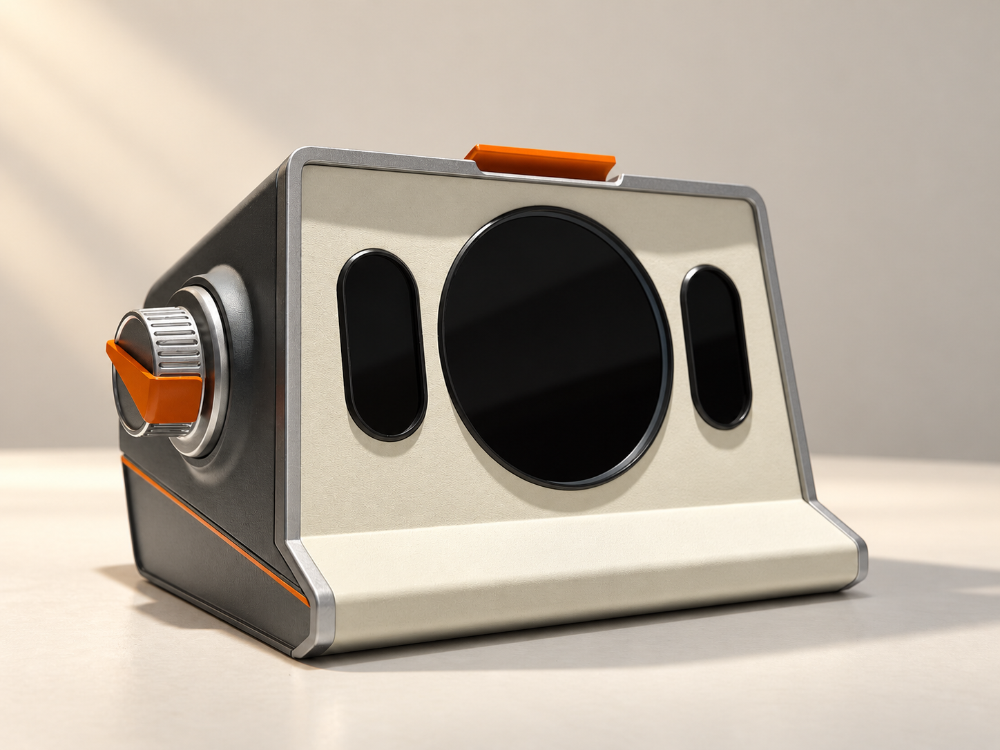

### 左前侧 · 顶部坡面修正版

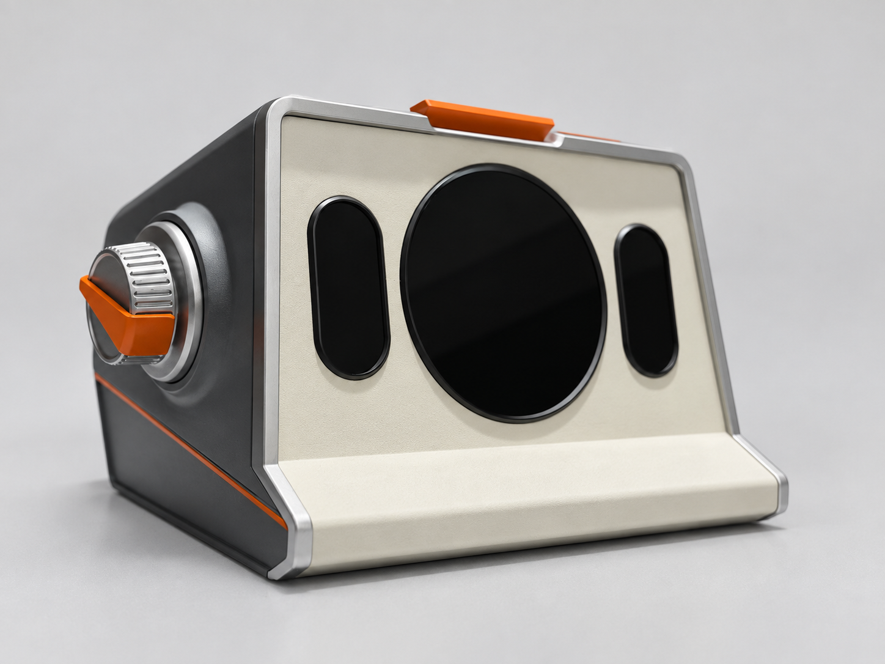

## Worldflow 世界屏幕版本

固定左前侧柔光底图，左右屏幕均点亮。中屏使用已有 Worldflow 定帧作为图像输入，由 AI 适配圆屏构图，并非逐像素贴图。四张右屏现已按用户提供的 UI 母版修正为绿色电量指示、OPTIC 圆环和日期时间。右屏界面以新母版为准，左屏仍沿用旧效果示意。夜景版中屏边缘亮度与其他版本不同。

### 牧羊女 · 晨光阅读

来源世界：93.2-牧羊女；镜头：草地 / 早上 / 看书。

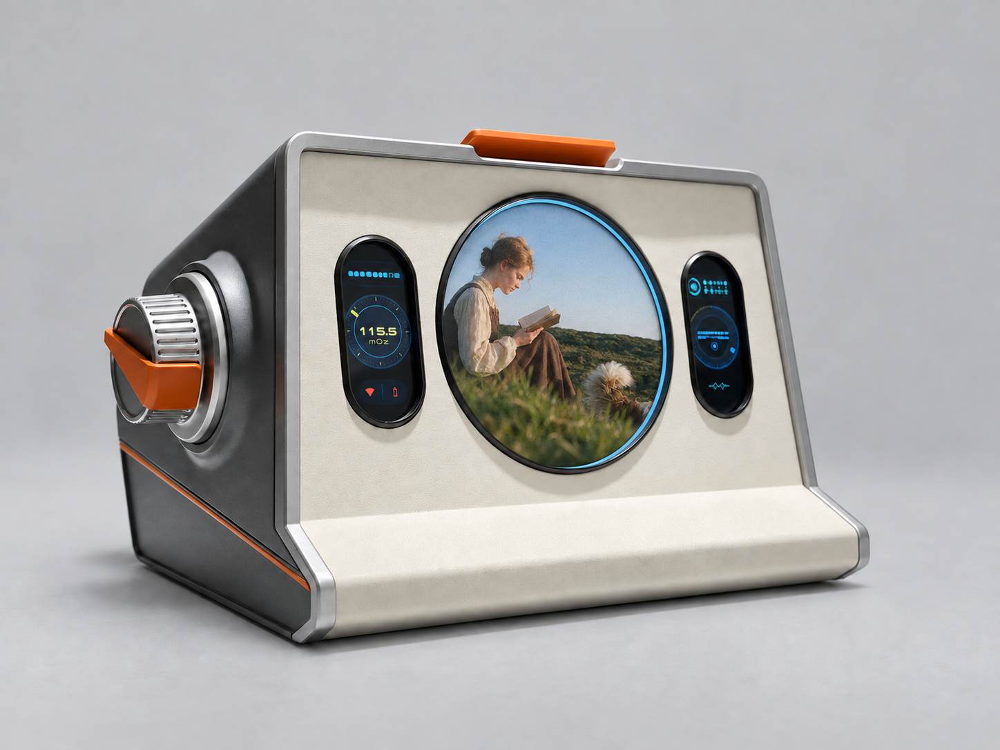

### 机器人 · 废弃图书馆

来源世界：92.5-贵州3-机器人与流浪猫；镜头：废弃图书馆 / 白天 / 机器人看书。

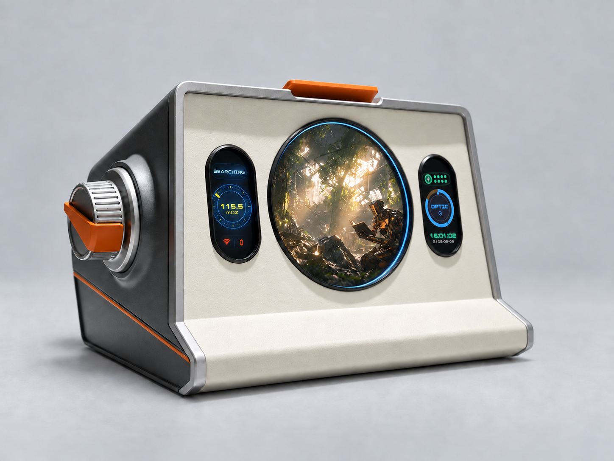

### 精灵 · 清晨睡眠

来源世界：93.9-贵州-精灵世界；镜头：睡眠叶 / 清晨 / 晨间睡眠。

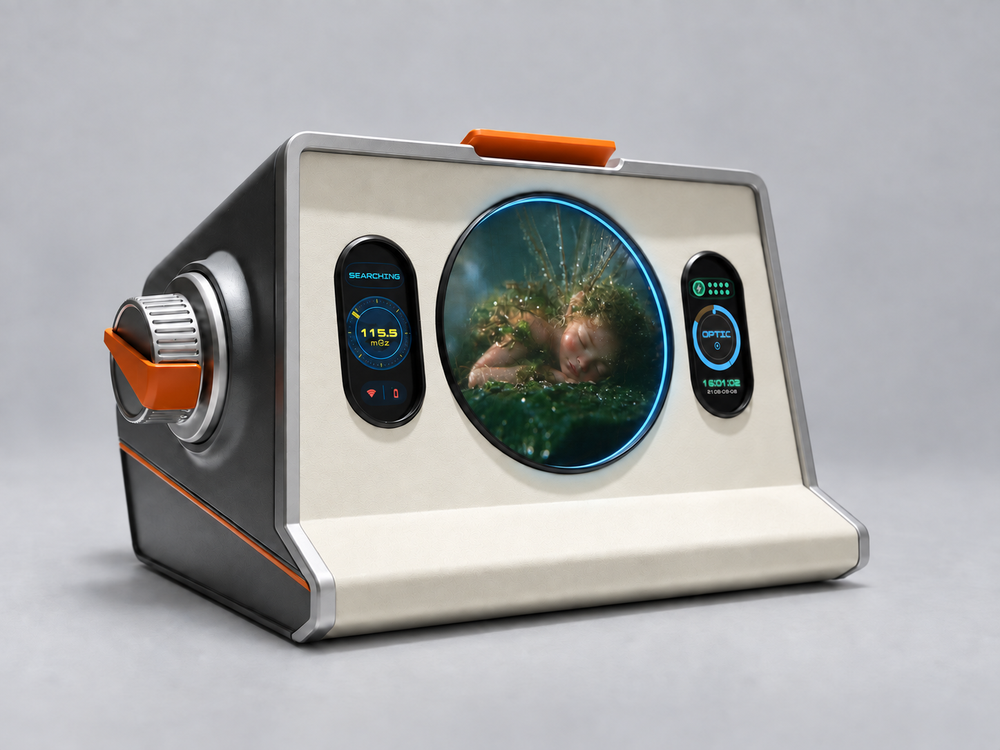

### 草地 · 静谧星夜

来源世界：93.2-牧羊女；镜头：草地 / 夜晚 / 空镜。

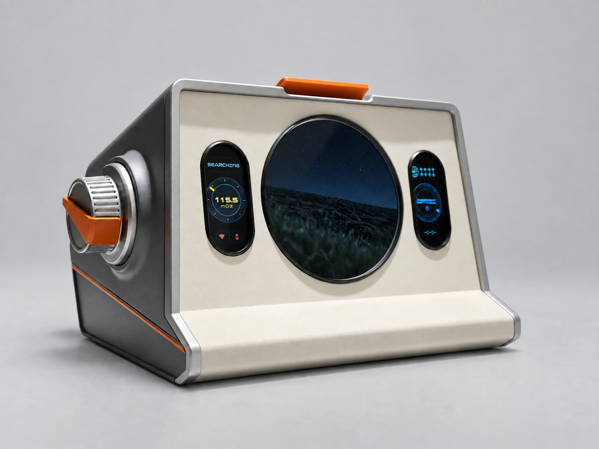

## 文件结构

```text
originals/        原始设计图片
generated/v1/     基础机位与光照辅助图
generated/v2/     顶部修正版
screen-variants/  四个世界亮屏效果
manifest.json     状态、提示词与校验值
```

公开展示供项目协作参考；本次发布不额外授予素材的商标或商业使用许可。
