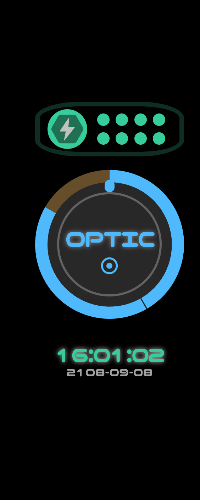
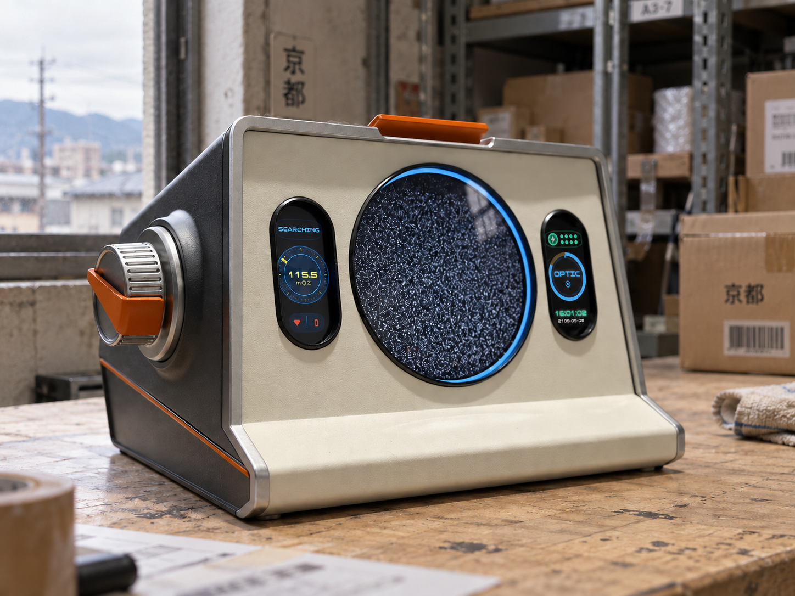
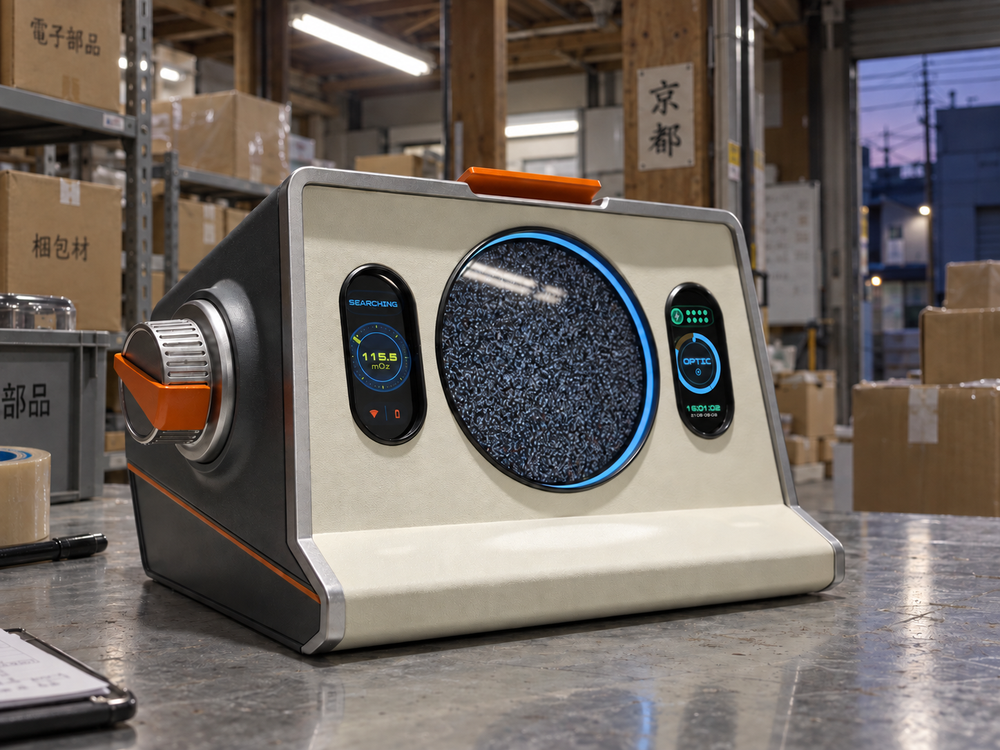
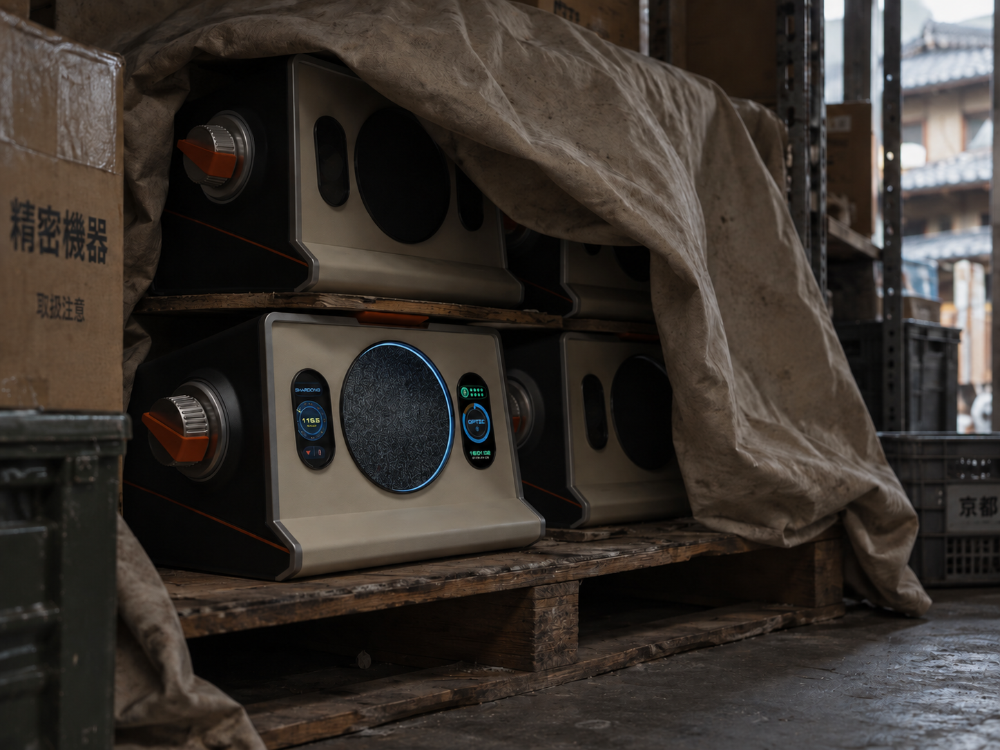

# 右侧屏幕修正记录

2026-09-09：用户提供清晰的右屏界面，要求复查历史有效图片并修正模糊右屏。本次检查 17 张历史生成图，修正其中 7 张可见右侧亮屏；9 张黑屏或背视图不需要点亮右屏，另 1 张明显变形的堆叠图继续弃用。

## 右屏母版

下图为用户提供的原始 UI，未经修改。它覆盖旧产品效果图中模糊的右屏图形；设备机身仍以三张产品原图为准。

- 顶部：绿色电量胶囊、闪电图标，右侧两行四列共 8 个绿色圆点。
- 中部：蓝色粗圆环、左上短棕色弧段、深灰内盘、明确的 `OPTIC` 字样与小同心圆。
- 底部：绿色 `16:01:02`，灰色 `2108-09-08`；保留两行层级。
- 保持原有胶囊屏开孔、黑底、边框和透视，不使用模糊波形代替文字。

## 逐图结果

| 历史图片 | 处理 |
| --- | --- |
| 基础 01 正面中性柔光 | 三屏关闭，保留 |
| 基础 02 左前柔光 | 三屏关闭，保留 |
| 基础 03 右前柔光 | 三屏关闭，保留 |
| 基础 05 后侧 | 右屏不可见，保留 |
| 基础 06 左前暖光 | 三屏关闭，保留 |
| 基础 v2 顶部修正版 | 三屏关闭，保留 |
| 仓库 01 日间工作台 | 三屏关闭，保留 |
| 仓库 02 收货区 | 三屏关闭，保留 |
| 仓库 03 窗边雪花屏 | 右屏修正 |
| 仓库 04 傍晚雪花屏 | 右屏修正 |
| 仓库 05 旧帆布下的设备 | 可见右屏关闭；仅作场景参考 |
| 仓库 06 防尘布藏放 | 仅修正下层左侧亮机的右屏，其他设备继续黑屏；仅作场景参考 |
| 仓库 07 搬运毯堆叠 | 中间设备明显变形，继续弃用；不通过本次 UI 修正恢复有效状态 |
| 世界 01 牧羊女晨光 | 右屏修正 |
| 世界 02 机器人图书馆 | 右屏修正 |
| 世界 03 精灵晨眠 | 右屏修正 |
| 世界 04 草地星夜 | 右屏修正 |

此前被排除的两张顶部错误尝试不属于有效参考库，不恢复使用。三张用户产品原图保持原始文件不变。

## 修正版

四张世界版本已在[主素材目录](README.md)中更新。下列是本次一并修正的仓库版本：

### 窗边仓库

### 傍晚仓库

### 防尘布藏放

## 核验与使用

本次使用内置 image_gen 按右屏母版局部编辑。已逐张目视核对右屏图形层级、OPTIC 字样、电量点阵、日期时间两行，以及机身外轮廓和原有画面内容。输出为 1448×1086 的完整场景图，远景中的小字仍受实际像素数量限制；需要 UI 特写时直接使用母版，而非放大整张远景图。

生成式编辑可能微调材质纹理和画面细节，不能视为屏幕以外像素完全锁定的合成。正式视频中采用 UI 母版透视贴图和独立反射层可进一步保证一致性。

完整编辑提示词、版本与校验值见 [manifest.json](manifest.json)。旧版右屏图已由本地历史归档保留，当前公开文件指向修正版。
