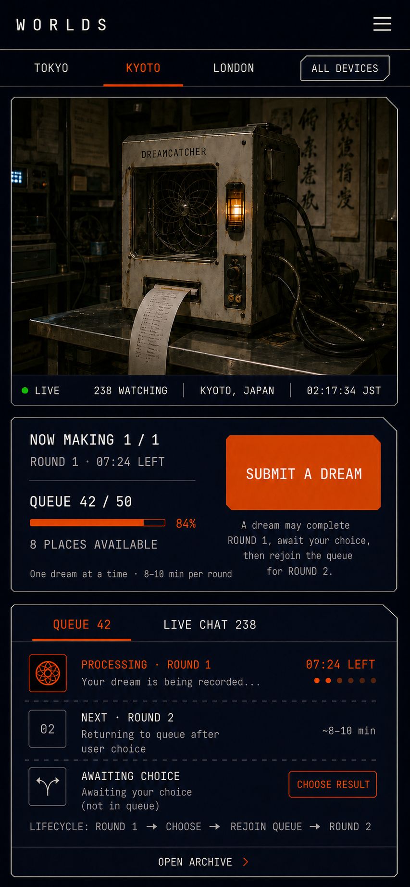
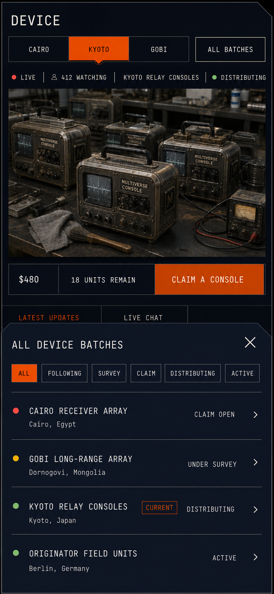

# Multiverse Collective｜伪直播观察室功能描述

> 文档性质：产品体验与功能效果说明。
>
> 核心范围：Worlds（以“捕梦仪”为例）与 Device 两个模块的伪直播化改造。
>
> 目标：把原本以列表和档案为主的页面，改造成会持续发生事件、值得用户第二天回来继续观看的在线观察现场。

---

## 一、核心产品定义

Worlds 与 Device 不再首先被理解为两个资料库，而是两间持续在线的**观察室**。

用户进入页面时，首先看到的不是一组卡片或历史记录，而是一个正在工作的镜头：捕梦仪正在处理某个人提交的梦；某一批 Console 正在现场被清理、测试或包装。镜头下面的队列、更新、聊天和交易区负责解释此刻发生了什么，并允许用户加入其中。

这套体验希望制造三种连续感：

- **空间连续感**：设备似乎始终存在于一个真实地点，用户只是暂时离开了镜头。
- **时间连续感**：工作不会因为用户关闭页面而停止；队列、设备状态和讨论仍会继续推进。
- **共同在场感**：其他观众、NPC、操作人员和系统消息都在围绕同一个对象作出反应。

产品由此从“我来浏览一些已经完成的内容”，变成：

> **我来看一件正在发生的事，并确认它从昨天到今天发生了什么变化。**

这也是 Multiverse Console 的屏幕监控概念在网站上的直接延伸：用户面对的不是普通内容流，而是一组通往其他设备、地点和世界的观察窗口。

---

## 二、两个模块共用的体验骨架

两个模块共享同一套页面语法，但直播对象与参与方式不同。

1. **对象切换栏**：位于页面顶部。Device 切换不同 Batch；Worlds 切换分布在世界各地的 Dreamcatcher。
2. **完整列表入口**：当对象数量超过顶部可展示范围时，打开可筛选、可滚动的完整列表。
3. **直播镜头**：页面中最重要、面积最大的内容，用于建立场景、对象与当前状态。
4. **实时状态带**：显示直播状态、观看人数、当前动作、最近变化和必要的时间信息。
5. **参与区**：Worlds 中是提交梦境；Device 中是跟踪、申领或支付。
6. **事件内容区**：Worlds 中是处理队列与聊天；Device 中是最新现场更新与聊天。竖屏通过页签切换，不使用并排双栏。
7. **档案入口**：承载已经发生过的内容，让直播间保持“现在时”，同时让所有结果都可追溯。

顶部切换栏始终切换**直播对象**，不是切换镜头角度：

- Device 的一个 tab 对应一个 Batch，也对应一个独立直播页；
- Worlds 的一个 tab 对应一台具体 Dreamcatcher，也对应它自己的地点、时区、容量、队列和聊天；
- 当前对象使用橙色活动态，其余对象使用暖白弱化态；
- 横向栏只展示少量近期、关注或推荐对象，完整集合交给右侧列表按钮。

页面不是把视频、聊天、列表和购买模块简单拼在一起，而是让同一个事件同时在多个区域留下痕迹。例如：

- 镜头中捕梦仪开始运行；
- 队列中的某条记录变为“处理中”；
- 聊天中出现系统提示；
- 处理完成后镜头里出现输出；
- 结果进入梦境档案；
- 官方身份在聊天中发布发现摘要。

用户因此能理解每个变化的前因后果，而不是只看到一条孤立的新消息。

---

## 三、Worlds：捕梦仪直播观察室

### 3.1 页面给人的第一印象

用户进入 Worlds 后，首先看到一个固定镜头下的捕梦仪。它位于真实、安静、略显神秘的工作环境中。镜头可以有低照度、轻微噪点和固定机位的质感，但界面本身仍保持克制、清晰和可信。

捕梦仪不是页面装饰，而是所有交互的中心：大家提交的内容真的会进入它的工作队列，它开始工作、结束工作和吐出结果，都会改变页面其他区域。

### 3.2 页面结构

竖屏手机是 Worlds 的默认构图，内容自上而下排列：

- 页面标题与全球 Dreamcatcher 切换栏；
- 当前 Dreamcatcher 的直播镜头；
- 位置、当地实时时间、直播状态和观看人数；
- 等待队列容量、梦境提交操作与信息入口；
- “队列／实时聊天”内容页签；
- Archive 入口。

#### 全球 Dreamcatcher 切换栏

Worlds 中的 Dreamcatcher 分布在世界各地。顶部横向栏可以显示例如 Tokyo、Kyoto、London 等地点，点击后进入对应设备的独立直播页。

切换设备会同时切换：

- 直播画面与场景；
- 城市、国家与当地时区；
- 当地实时钟；
- 设备在线和工作状态；
- 等待队列占用；
- 提交队列；
- 观看人数与聊天房间；
- 该设备产生的历史结果。

右侧 `ALL DEVICES` 按钮打开完整 Dreamcatcher 列表。列表应优先展示设备是否在线、所在城市、当地时间和是否仍接受提交，帮助用户在当前设备满载时迅速找到另一个可提交的目标。

直播镜头附近显示：

- `LIVE` 状态；
- 当前观看人数；
- 所在城市与国家；
- 按所在地时区持续前进的当地时间；
- 当前设备状态，例如 `PROCESSING / PAUSED / READY / PREPARING SIGNALS / OFFLINE`；
- `OPEN ARCHIVE` 档案入口。

位置和当地时间放在视频底部的状态带中。时间必须使用设备所在地时区，而不是访问者的本地时区；切换 Dreamcatcher 后，地点和时钟同时更新。这样不同地区设备的昼夜、工作节奏和现场画面能够互相印证。

### 3.3 制作规则、队列容量与提交区

每台 Dreamcatcher 有两个彼此独立的限制。

#### 制作能力：同时只制作一个

一台 Dreamcatcher 同一时间只能处理一个梦境。每一次寻找是一个独立轮次，每轮消耗固定时长，例如 8 分钟或 10 分钟。

这个限制不需要在直播镜头和提交区之间重复显示 `NOW MAKING 1 / 1`。当前正在制作的唯一梦境已经是下方队列列表的第一项；该列表项显示当前轮次和 `PROCESSING` 状态即可，不展示精确倒计时。

制作位是否被占用不决定用户能否提交。只要等待队列没有达到上限，新梦境仍可以进入队列。

#### 排队能力：等待队列最多 50 个

每台 Dreamcatcher 的等待队列最多容纳 50 个任务，不包含当前正在制作的一个任务，也不包含正在等待用户选择的梦境。

提交区保持紧凑，只显示完成决策所必需的信息：

- 当前设备状态，例如 `PROCESSING`、`PAUSED` 或 `READY`；
- 是否仍在接受梦境；
- 每轮大致为 8–10 分钟的预估，不提供倒计时或承诺完成时刻；
- 梦境输入；
- 提交按钮；
- 一个圆圈 `i` 信息入口。

提交区不再常驻解释“这里在做什么”“每轮需要多久”“第一轮和第二轮如何衔接”等大段文字。圆圈 `i` 使用至少 44 × 44px 的触控区域，点击后打开信息弹窗或底部抽屉，集中说明：

- 这台 Dreamcatcher 的作用；
- 同时只能制作一个梦境；
- 每轮通常需要 8–10 分钟；
- 队列存在上限，以及设备满载时为什么必须切换；
- 第一轮寻找、用户选择、重新入队与第二轮寻找的流程；
- 队列满载后为什么需要切换到其他 Dreamcatcher。

关闭信息层后，用户回到原输入位置，已经输入的内容不丢失。

当队列少于 50 个时，用户可以提交。提交成功后，新任务进入队尾，队列人数增加一个。

当队列达到 `50 / 50` 时：

- 输入与提交按钮进入禁用状态；
- 页面清楚显示 `QUEUE FULL`，而不是把机器描述为无法工作；
- 提供“选择其他 Dreamcatcher”的直接操作；
- 完整设备列表优先展示仍有排队位置且在线的设备；
- 用户已经输入的草稿被保留，切换设备后可以继续提交。

当前任务制作完成、队首任务进入制作位后，队列会释放一个位置，页面随即恢复接受新提交。最终提交时仍需再次校验队列位置，避免多个用户同时抢到第 50 个位置。

### 3.4 用户提交后的完整反馈链路

1. 用户在直播镜头下方的队列与提交区输入关于梦境或世界的想法。
2. 页面立即确认提交成功，但不显示其前面还有多少个任务，也不承诺精确开始时间。
3. 新内容进入当前 Dreamcatcher 的队列，状态为“等待中”。
4. 前面的梦境逐个完成，该内容每完成一次前移一个位置。
5. 轮到该内容时，它离开等待队列、占用唯一制作位，并进入“第一轮寻找”。
6. 第一轮持续固定时长，例如 8 分钟或 10 分钟；界面显示 `PROCESSING` 和大致轮次耗时，但不显示倒计时。期间镜头中出现机械动作、状态灯、纸张或屏幕变化，以及来自吴梦怡的进度消息。
7. Dreamcatcher 吐出第一轮结果后，该任务释放制作位并进入“等待选择”，此时既不占制作位，也不占等待队列位置。
8. 用户查看第一轮结果并作出选择。这个选择决定第二轮继续寻找的方向。
9. 用户确认选择后，任务必须回到最初提交的同一台 Dreamcatcher，以“第二轮寻找”的身份重新进入队列，并再次占用一个等待队列位置。不同设备未来可能拥有不同能力，因此不能自动改投其他设备。
10. 任务再次随队列逐个前进，轮到时占用制作位并完成第二轮寻找。
11. 每轮结果都会写入同一梦境记录，并由官方身份同步发布到聊天区。
12. 达到该梦境要求的最终轮次后，记录进入 Archive 的“已完成”分类。
13. 提交者在轮到制作、需要选择和新结果产生时收到通知。

这条链路最重要的效果，是让用户相信自己的输入没有消失在表单之后，而是进入了一个公开、可观察、有时间成本的处理过程。

### 3.5 队列的作用

队列既是状态说明，也是直播节奏的一部分。每条记录至少呈现：

- 梦境标题或一句话摘要；
- 提交者身份；
- 当前状态；
- 与投票或处理相关的必要信息。

建议使用的状态包括：

- **等待投票**：内容已公开，社区决定是否优先送入捕梦仪；
- **第一轮排队中**：已经进入等待队列，逐个向前；
- **第一轮寻找中**：正在占用唯一制作位；
- **等待选择**：第一轮结果已经产生，等待用户决定下一步，不占队列位置；
- **第二轮排队中**：用户已经选择，任务重新进入队尾；
- **第二轮寻找中**：再次占用唯一制作位；
- **本轮已捕获**：当前轮次的结果刚刚产生；
- **已归档**：完整记录可在 Archive 中查看。

队列不显示“前面还有多少个”，也不依据队列位置展示倒计时。对伪直播而言，“设备正在处理、暂停、准备信号还是空闲”以及“我的任务正在等待制作、等待社区选择还是返回原设备”比一个看似精确但会变化的时间更重要。

### 3.6 实时聊天

聊天区是共同在场感的主要来源，内容由四类身份构成：

- 普通观看者：讨论镜头变化、梦境和结果；
- 提交者：补充自己的梦境背景或回应发现；
- 吴梦怡／操作人员：解释捕梦仪正在做什么；
- 系统／官方身份：发布队列变化、处理开始、处理完成与档案链接。

官方事件消息需要与普通聊天在视觉上明确区分，并能够点击回到对应梦境记录。聊天不是独立社交房间，它始终围绕“镜头里正在发生的事”组织。

### 3.7 Archive 的角色

Archive 负责承载完整历史，避免直播页重新退化为长列表。它至少包含：

- 所有已提交梦境；
- 等待投票的梦境；
- 已进入处理队列的梦境；
- 已完成并产生结果的梦境。

从 Archive 打开任意记录时，用户可以看到它的提交内容、投票过程、排队时间、处理事件、捕梦结果以及相关讨论。直播间提供“现在”，Archive 保存“这件事如何走到现在”。

### 3.8 Worlds 概念效果图

图中表现约 390 × 844 竖屏环境下的基本构图：顶部在 Tokyo、Kyoto、London 等 Dreamcatcher 之间切换；直播状态带显示京都位置和 JST 当地时间；下方表现队列、第一轮制作、等待选择和选择后重新进入第二轮队列的状态。**本轮更新后的最终规格应删除图中独立的 `NOW MAKING 1 / 1` 摘要和常驻说明文字，仅保留 `QUEUE n / 50`、输入、提交按钮与圆圈 `i` 信息入口；当前制作状态只在队列列表中显示。**图内具体时间、队列人数、观看人数和英文内容均为示意，不代表最终产品数据。

---

## 四、Device：设备批次直播观察室

### 4.1 页面给人的第一印象

Device 页面让用户持续跟踪一批真实 Console 从“只有线索”到“建立固定镜头”，再到清理、修复、测试、包装和发放的全过程。

直播在这里不仅增加氛围，也承担信任建立：用户可以看到设备确实存在、团队确实在工作、批次状态确实发生变化。交易不再发生在一张静态商品详情页上，而是发生在一个持续更新的现场旁边。

### 4.2 三个镜头阶段

设备批次根据故事和现场条件逐步获得更清晰的可见性。

#### 第一阶段：只有情报

团队知道设备可能存在，但尚未架设任何摄像头。主区域仍保留“观察窗口”的尺寸和位置，但显示的是当前获得的证据：现场照片、音频、地图级地点描述、目击材料或调查摘要。

重点不是假装已经直播，而是让用户清楚知道：**镜头尚未建立，调查正在接近目标。**

#### 第二阶段：远距或模糊机位

团队找到了一个大致角度，可以远距离、遮挡地或不稳定地看到设备所在空间。画面可能间歇出现、低清、偏暗或只能看到局部。

这个阶段的价值在于“第一次看见它”。清晰度的提升本身就是剧情进展，用户会等待更可靠的观察角度出现。

#### 第三阶段：固定摄像头

现场建立稳定机位，用户可以持续看到设备和工作人员留下的变化。批次进入清理、测试、包装等阶段后，画面应随现实或内容排期发生可辨认的改变。

不同阶段必须明确标注镜头来源与可用程度，避免把预录、间歇影像或档案素材伪装成真正的连续实时画面。

### 4.3 Batch 切换栏

Device 页面顶部的 tab 栏用于切换不同设备 Batch，不用于切换摄像头。

每个 tab 对应一个独立 Batch 直播页。切换后，页面中的镜头、故事阶段、状态、最新更新、聊天、价格、库存与交易资格都切换到该 Batch。当前 tab 使用清楚的选中状态，同时保留可触达的 `ALL BATCHES` 按钮。

顶部横向栏不承担完整档案导航。它只展示少量高相关 Batch，例如：

- 当前正在观看的 Batch；
- 用户已关注的 Batch；
- 最近有变化的 Batch；
- 当前开放申领的 Batch。

#### ALL BATCHES 弹窗

点击 `ALL BATCHES` 后，在竖屏中从底部打开不透明的列表弹窗。背景仍保留当前直播页的上半部分，使用户知道自己正在从哪一个 Batch 出发，但弹窗本身拥有独立滚动区域。

弹窗逻辑与当前 Device Batch Archive 保持一致，包含：

- `ALL`：全部 Batch；
- `FOLLOWING`：用户关注的 Batch；
- `SURVEY`：探测中；
- `CLAIM`：开放申领；
- `DISTRIBUTING`：发放中；
- `ACTIVE`：已在现场运行。

每一行至少显示 Batch 名称、地点、当前阶段和进入箭头。当前所在 Batch 标记为 `CURRENT`。点击任意行关闭弹窗并进入该 Batch 的独立直播页；关闭弹窗则返回原直播位置。

列表沿用现有四个正式状态及其含义：

| 数据状态 | 用户显示 | 直播页含义 |
|---|---|---|
| `survey` | `UNDER SURVEY` | 只有情报、远距画面或正在建立镜头 |
| `claim_open` | `CLAIM OPEN` | 已满足申领条件，交易区开放 |
| `distribution` | `DISTRIBUTING` | 正在准备 Pack、测试、包装或发放 |
| `active` | `ACTIVE` | Console 已交付并在持有者现场运行 |

### 4.4 Batch 内的多机位机制

一批设备可以拥有多个相关镜头，例如：

- 工作台：清理、拆检和测试；
- 包装区：组装 Pack、编号与封装；
- 存放区：批次全貌与数量变化；
- 相关地点：设备发现地、运输节点或其他故事现场。

如果同一 Batch 拥有多个机位，机位切换控件应位于视频播放器内部或紧邻视频的二级控制区，不能占用页面顶部的 Batch tab 栏。每个机位显示自己的在线状态和最后更新时间；离线机位保留最后一帧与离线原因，而不是变成空白区域。

### 4.5 直播区的内容边界

页面上方的主画面始终是直播区域，只承载当前直播、间歇直播或明确标记的摄像头状态，不承担历史素材浏览。

- 摄像头在线时，显示当前直播内容；
- 直播间歇时，显示最后一帧、最后在线时间和下一次预计恢复时间；
- 尚未建立摄像头时，显示“直播尚未建立”的中性状态和当前调查进度；
- 不使用过去拍摄的图片、视频或宣传素材填充直播区；
- 所有过往图片与视频统一进入下方 `INFO` 栏目。

这条边界保证用户始终知道上方画面代表“现在能看到什么”，不会把历史影像误认为实时直播。

### 4.6 交易／申领区域

交易区位于直播镜头和下方讨论区域之间。它是一个紧凑、持续可见的状态带，而不是打断现场感的普通商城卡片。

付款区域需要把一次申领所包含的**三次寄送**完整展示出来。这里的“三次寄送”属于当前 Device Batch 的履约计划，不是顶部用于切换设备批次的 Batch：

| 寄送阶段 | 展示内容 |
|---|---|
| `PACK ONE` | 第一批实体内容、包含物、预计寄送窗口与当前状态 |
| `PACK TWO` | 第二批实体内容、包含物、预计寄送窗口与当前状态 |
| `MULTIVERSE CONSOLE` | 最终 Console、预计寄送窗口与当前状态 |

三次寄送可以使用紧凑的三行摘要或三段式结构，并明确标出 `COMPLETED / CURRENT / UPCOMING`。用户不需要离开直播页，就能理解本次付款会获得什么、分别何时寄出，以及当前已经走到哪一次寄送。付款或申领仍只保留一个清楚的主操作，不为三次寄送拆出三个互相竞争的按钮。

这里可以显示：

- 单台价格或当前付款阶段；
- 可申领／剩余数量；
- 当前批次状态；
- `3 SHIPMENTS INCLUDED` 及三次寄送的内容、预计窗口与状态；
- 申领、支付定金或完成尾款的唯一主操作；
- 必要的交付或 Pack 提示。

用户作出购买决定时，能够同时看到镜头中的设备、最近的真实进展以及社区讨论。交易因此成为“加入这批正在发生的行动”，而不仅是购买一个硬件 SKU。

### 4.7 底部三栏内容区

交易区下方固定设置三个 tab：`LIVE CHAT`、`UPDATES`、`INFO`。三个栏目共享同一内容区域，竖屏中一次只展开一个，切换时保留各自的滚动位置。

- `LIVE CHAT`：围绕当前直播发生的实时讨论；
- `UPDATES`：结构化的批次进展与状态变化；
- `INFO`：设备和 Batch 的基础资料，以及所有历史图片与视频。

`INFO` 是默认栏目。用户首次进入某个 Device 直播页，或从顶部切换到另一个 Batch 时，首先看到设备介绍、当前履约阶段和已有证据，再自行进入聊天或更新。这样用户不会在不了解设备背景的情况下直接掉进对话流。有未读官方更新时，`UPDATES` 显示提示点或数量，但不强制抢走当前 tab；用户在同一 Batch 内主动切换栏目后，可在本次访问中保留最后选择。

### 4.8 Live Chat

Device 聊天比 Worlds 更依赖 NPC 和团队身份，以保证冷启动时页面仍有叙事密度。可能出现的身份包括：

- 现场技术人员：发布测试和修复观察；
- 档案人员：补充设备来源与历史材料；
- 物流／包装人员：说明发放进度；
- Batch 持有者或申领者：讨论自己的 Unit 与 Pack；
- 普通观看者：围绕镜头和更新提出问题。

NPC 内容应由真实批次事件触发，并尽量回应用户眼前可以看到的变化。它们不是为了制造虚假热闹，而是把后台进度翻译成具有角色视角的现场叙事。

### 4.9 Updates

`UPDATES` 显示结构化现场事件，例如：

- 新机位上线；
- 某组设备完成清理；
- 某台设备通过或未通过测试；
- 包装材料抵达；
- Pack 开始组装；
- 批次进入下一阶段。

点击更新可以切换到相关机位、定位对应直播时间点或打开完整记录。更新流提供事实骨架，聊天区负责承载现场反应。若一条更新关联历史图片或视频，更新中只显示媒体提示和进入 `INFO` 的链接，不在更新流中重复铺开媒体画廊。

### 4.10 Info

`INFO` 是 Device 页的默认栏目，也是当前 Batch 的资料、履约进度与历史媒体中心。

页面最前面显示当前 Batch 的四格进度条：

| `PREPARING` | `PACK ONE` | `PACK TWO` | `MULTIVERSE CONSOLE` |
|---|---|---|---|
| 设备确认、整理与首次寄送前准备 | 第一批内容准备或寄出 | 第二批内容准备或寄出 | 最终 Console 准备或寄出 |

四格始终按这个顺序出现，每一格分别呈现 `COMPLETED`、`CURRENT` 或 `UPCOMING`。当前格使用品牌橙突出，已完成格显示完成标记，未来格降低视觉权重；同时提供文字状态，不能只依靠颜色表达。移动端应保证四格仍可一次看懂，可以缩短辅助文案，但不能隐藏阶段名称。

这条四格进度与 Batch Archive 的生命周期状态并不冲突：`SURVEY / CLAIM OPEN / DISTRIBUTING / ACTIVE` 用来描述整个 Device Batch 在系统中的宏观状态；`PREPARING / PACK ONE / PACK TWO / MULTIVERSE CONSOLE` 用来描述用户在当前 Batch 内看到的具体履约进度。其中 `PREPARING` 是准备阶段，不属于寄送；付款区域展示的三次寄送，正好对应后面三格。

进度条下方可以看到：

- Batch 名称、编号、地点与当前生命周期状态；
- 简介、已确认数量、负责人和下一里程碑；
- 当前交易、申领或持有状态的补充说明；
- 已经获得的所有现场图片；
- 已经获得的所有历史视频与短片；
- 图片和视频对应的拍摄时间、来源、说明及关联更新；
- Batch 的调查、修复、测试、包装和发放档案。

#### 素材列表

文字介绍和四格进度下方是一条纵向排列的素材列表，而不是瀑布流相册。列表中的每一行代表一份独立素材记录，并按时间持续向下排列。默认可以让最新素材在前，也可以按设备阶段进行分组。

一行素材可以是三种形态：

- **单个视频**：显示视频缩略图、播放标记、时长和当前可用状态；
- **单张图片**：显示一张主缩略图；
- **一组图片**：用两到三张略微错位或叠放的缩略图表示，并显示图片总数，例如 `+4`。

不论素材类型，每行都使用一致的信息骨架：缩略图在左，右侧显示素材标题或一句话说明、拍摄时间、来源、所属阶段，以及关联的 `UPDATES` 记录。整行均可点击；点击后进入沉浸式图片／视频查看器或该组图片的浏览层，再从详情回到原来的列表位置。

素材流本身就是该设备不断积累的证据时间线。它可以一直向下延伸，并使用分页或渐进加载控制性能；不把同一次现场更新里的多张相似照片拆成大量独立行，而是合并成一组。历史媒体详情可以跳回相关 `UPDATES` 记录；反过来，更新也可以定位到 `INFO` 中对应的素材行。这样直播、事实更新和历史证据彼此关联，但不会混在同一个画面里。

### 4.11 Device 概念效果图

图中表现约 390 × 844 竖屏环境下的京都 Batch 直播页，并展示 `ALL BATCHES` 弹窗的打开状态。顶部 Cairo、Kyoto、Gobi 是不同 Batch，不是不同机位；弹窗中的过滤与状态沿用现有 Batch Archive 逻辑。**本轮更新后的底部内容区固定为 `LIVE CHAT / UPDATES / INFO` 三个 tab，并默认打开 `INFO`；`INFO` 顶部显示 `PREPARING / PACK ONE / PACK TWO / MULTIVERSE CONSOLE` 四格进度。付款区域同时展示后三个阶段对应的三次寄送内容。图中弹窗下方露出的双 tab 仅属于上一轮概念稿。**上方直播区只显示直播内容，历史图片和视频全部进入 `INFO`。图内价格、数量、人数和更新均为示意。

---

## 五、两个模块的共同点与区别

| 维度 | Worlds／捕梦仪 | Device／设备批次 |
|---|---|---|
| 直播对象 | 一台正在处理梦境的捕梦仪 | 一批正在被发现、修复和发放的 Console |
| 顶部切换单位 | 分布在不同城市的 Dreamcatcher | 不同生命周期阶段的 Batch |
| 完整列表重点 | 在线状态、地点、当地时间、队列剩余位置 | 关注关系、地点与 Batch 阶段 |
| 核心悬念 | 下一条输入会产生什么结果 | 这批设备接下来会发生什么变化 |
| 内容页签 | 队列、实时聊天 | Info（默认）、Live Chat、Updates |
| 主要用户动作 | 提交梦境、投票、聊天 | 跟踪、聊天、申领或支付 |
| 官方角色 | 吴梦怡、捕梦仪系统、档案身份 | 技术、档案、物流与 Batch 运营身份 |
| 结果沉淀 | 梦境记录与新发现 | 批次生命周期与 Unit 记录 |
| 回访动机 | 看队列是否轮到自己、捕梦仪吐出了什么 | 看镜头是否升级、设备是否完成新阶段 |

两者共享的不是一套表面布局，而是一条相同的产品循环：

> **看到现场 → 理解当前状态 → 参与或跟随 → 离开后事件继续 → 因新变化回来 → 在档案中确认历史。**

---

## 六、“伪直播”如何保持可信

伪直播不要求全天候传输一条真正的实时视频流，而是通过预录镜头、定时内容、状态变化和实时事件编排，产生“这个空间持续存在”的效果。可信度来自时间与状态的一致，而不是在所有地方写上 `LIVE`。

建议遵守以下原则：

- 明确区分直播、最近画面、录像回放、离线与仅有情报；
- 观看人数可以是当前房间的真实在线人数，或使用更诚实的“今日观看”口径；
- 系统消息、镜头变化、队列变化和 Archive 结果必须指向同一个事件；
- NPC 不能声称发生了镜头与后台状态都没有支持的事情；
- 重要结果不能只存在于聊天中，必须进入正式记录；
- 内容较少时允许镜头保持安静，不用持续制造无意义动作；
- 页面应显示“最后更新”或明确的时间口径，让用户知道自己看到的是现在、刚刚还是历史。

这种克制反而能增强代入感：真正的监控画面大部分时间并不戏剧化，因此一次状态灯变化、一次纸张输出或一批设备被移走，才会显得重要。

---

## 七、让用户明天再来的机制

直播观察室的长期吸引力来自未完成状态，而不是无限滚动。

- 用户知道下一次可观察的变化是什么；
- 用户提交的内容在公开队列中持续前进；
- 批次镜头会从不存在、模糊逐步变为稳定和多角度；
- 每次设备状态变化都在镜头、更新与聊天中留下可追踪证据；
- 用户可以关注一个房间，并只在真正有变化时收到通知；
- 错过直播不等于错过内容，Archive 会保存关键事件和结果；
- 回访时页面首先告诉用户“自你上次离开后发生了什么”。

通知应围绕真实变化发送，例如：

- 你提交的梦境进入处理；
- 捕梦仪产生了新结果；
- 你关注的批次建立了第一个稳定机位；
- 你关注的 Unit 完成测试；
- 包装直播将在明天开始。

---

## 八、竖屏优先与桌面增强

竖屏手机是两类直播观察室的默认设计目标，两张概念图也以约 390 × 844 的手机视口为基准。桌面端只是在同一信息顺序上的横向增强。

在约 390 × 844 的竖屏中：

1. 顶部对象栏使用横向可滚动 tab，并在右侧保留完整列表按钮；
2. 直播镜头首先出现并保持可用的横向画幅；
3. 状态带和主操作紧随镜头，不被折叠隐藏；
4. Worlds 的地点、当地时间和 `n/50` 队列状态必须在提交之前可见，制作状态只在队列列表中显示；
5. Worlds 使用“队列／聊天”页签，Device 使用“Live Chat／Updates／Info”三页签并默认打开 Info；
6. 当前处理条目或最新更新在页签上方保留一行摘要；
7. 输入框在软键盘出现时仍可见，不覆盖关键内容；
8. Batch 或 Dreamcatcher 完整列表使用底部弹窗和独立滚动；
9. Batch 内多机位使用播放器内部的二级控件；
10. Archive、Follow 和观看人数保持易触达，但不与主操作争夺注意力。

桌面端是对同一信息结构的横向增强，而不是移动端体验的前提。

---

## 九、功能边界与建议优先级

第一版最重要的是验证“用户是否因为一个持续变化的对象而回来”，不需要一开始就建设真正的 24 小时视频基础设施。

### 第一优先级

- Device Batch 顶部切换栏与 `ALL BATCHES` 弹窗；
- 弹窗复用 `SURVEY / CLAIM OPEN / DISTRIBUTING / ACTIVE` 状态；
- Worlds 全球 Dreamcatcher 切换栏与完整设备列表；
- 每台 Dreamcatcher 的独立地点、时区、实时时钟、单制作位和 50 个等待位置；
- 队列满载禁用、草稿保留与其他可用设备推荐；
- 第一轮寻找、等待选择、重新入队与第二轮寻找闭环；
- 每个房间只有一个主镜头；
- 清楚的直播／回放／离线状态；
- Worlds 的提交、队列、处理完成与 Archive 闭环；
- Device 的阶段变化、最新更新、Follow 与交易状态带；
- Device 的 `LIVE CHAT / UPDATES / INFO` 三栏内容区；
- Device 默认打开 `INFO`，并显示四格履约进度；
- 付款区域展示 `PACK ONE / PACK TWO / MULTIVERSE CONSOLE` 三次寄送的内容与状态；
- 直播区与历史媒体的严格分离；
- 系统／官方消息与普通聊天；
- “自上次离开后”的事件摘要；
- 变化通知。

### 第二优先级

- Batch 内多机位切换；
- 社区投票决定 Worlds 的优先处理对象；
- 点击更新定位镜头时间点；
- Batch 持有者专属身份和讨论；
- 更丰富的 NPC 角色与排期内容。

### 后续能力

- 真正的现场直播接入；
- 与实体 Console 状态联动；
- 地区或 Unit 专属镜头；
- 关键事件自动生成短回放；
- 同一世界或设备在多个观察室之间的交叉事件。

---

## 十、视觉原则

两间观察室继续使用现有 Style A 设计系统：深空蓝背景、Pantone 1665 C 橙、暖白文字、Courier Prime、扁平色块、细分隔线和一个右上缺角。直播感主要来自真实镜头、时间、状态和事件，不依赖发光、渐变、玻璃拟态或装饰性 HUD。

镜头可以粗粝，界面必须清楚；世界可以神秘，状态必须可信；聊天可以有角色感，关键事实必须进入档案。

最终希望形成的产品印象是：

> **Multiverse Collective 不是展示设备与世界的目录，而是一组始终开着的观察窗口。用户每次回来，都可能看到另一边又发生了一点变化。**

---

## 附录：概念图生成说明

两张图均使用内置图像生成模式制作，类型为竖屏、高保真 `ui-mockup`。

- Worlds 图的生成方向：约 390 × 844 竖屏界面；顶部切换 Tokyo、Kyoto、London 等全球 Dreamcatcher；京都固定镜头显示位置与 JST 当地时间；提交区只保留 `QUEUE 42 / 50`、输入、提交按钮和圆圈 `i` 信息入口；当前制作轮次与剩余时间只在队列列表中显示；下方表现“第一轮 → 选择 → 重新入队 → 第二轮”的循环。
- Device 图的生成方向：约 390 × 844 竖屏界面；顶部 Cairo、Kyoto、Gobi tab 切换不同 Batch；京都固定镜头下方保留交易状态带，并展示 `PACK ONE / PACK TWO / MULTIVERSE CONSOLE` 三次寄送；打开 `ALL DEVICE BATCHES` 底部弹窗，并以现有四阶段逻辑展示完整列表。最终实现的底部内容区为 `LIVE CHAT / UPDATES / INFO` 且默认打开 `INFO`；`INFO` 顶部显示 `PREPARING / PACK ONE / PACK TWO / MULTIVERSE CONSOLE` 四格进度，历史图片和视频只进入 `INFO`。

两张图都明确排除了霓虹赛博朋克、青色主色、渐变、玻璃拟态、光晕、圆润卡片、装饰性坐标和无意义 HUD 文案。
