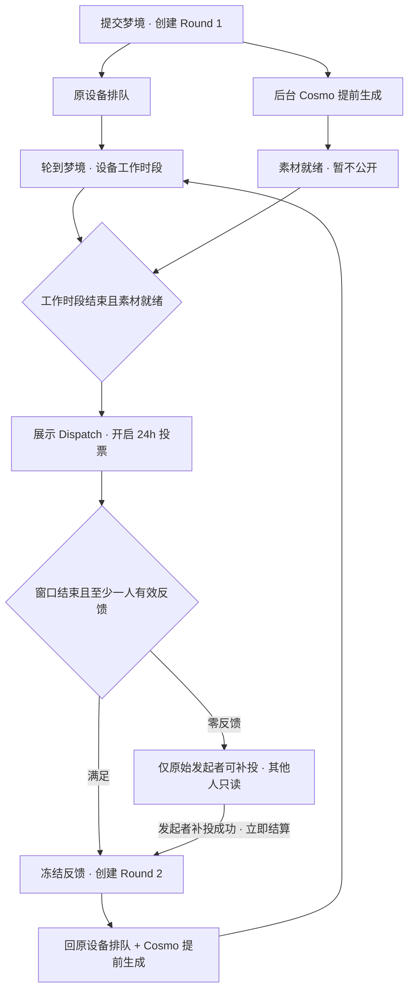

# Worlds · Dreamcatcher 梦境循环整合方案

> Public name: **Parallax Array / 视差阵列**. User submissions are **Observations / 观测记录**. `dreamcatcher` remains an internal identifier.
日期：2026-09-27。状态：产品规则已明确，本站轮次、队列、权限与展示已有本地实现；Cosmo 通信和取图沿用旧 Dispatch 链路，旧积压清理与停用保护已在生产完成，新轮次迁移与真实环境验收尚未完成。实现范围、验证结果及上线前置条件见[迭代记录](../releases/dreamcatcher-rounds.md)。下文保留设计依据，不能将本地实现视为已上线。

## 1. 产品目标与文档优先级

用户提交自己的梦境或所见，将它交给一台 Dreamcatcher。提交成功后，后台即可通过 Cosmo 接入并提前生成，同时梦境在前台排队。轮到该梦境后，设备经历设定的工作时段；工作时段结束且素材已就绪，才以 Signal Dispatch 展示结果并开启完整的 24 小时投票。窗口结束且至少一名有权限的用户反馈后（若截止零反馈，则仅原始发起者可在之后补投并立即触发结算），汇总本轮反馈，用于下一轮生成；同一个梦境重新进入原设备队列，显示 Round 2、Round 3、Round 4……。

这是一个模拟 Dreamcatcher 工作过程的持续探索体验。直播呈现设备工作，队列呈现处理顺序，Cosmo 提供真实生成结果，Dispatch 承载用户反馈，World 保存完整历史。用户不需要在几套独立模块之间重新提交同一个梦。

**用户本次明确的要求：**上报、入队、Cosmo 返回、Dispatch 作答、再次入队必须接成一条链；每轮增加明确的 Round 编号。保留同一个梦境及其上下文。**本次补充明确：保留 24 小时投票周期，至少一人反馈才能推进，正常窗口内不要求梦境主人投票；截止零反馈后，权限收窄为仅原始发起者可补投，补投成功立即进入下一轮，不重开 24h；后台生成与前台排队并行，已生成结果也必须等排到并完成设备工作时段后才展示。**

本文件是这条新循环的迭代依据，替代旧文档中与它冲突的“人工选中才能启动”“零反馈也自动回流”等设计。它不代表生产已完成改造。旧 Dispatch 自动生成、导入与召回已停用；历史保留规则及上线安排见 §9。

相关文档：
- [直播观察室](live-observation-rooms.zh.md)：共用页面骨架；Worlds 流程以本文为准。
- [世界构筑](../game-design/02-world-building/zh.md)、[Signal Dispatch](../game-design/03-signal-dispatch/zh.md)：历史机制与代码背景。
- [旧时间模型](../signal-tuning-timing.md)：保留 24h 窗口的背景依据；旧 scan/gap 和全局锚点不直接控制新轮次。
- [设计规范](../design-system.md)：视觉、字体、移动端与共享组件的权威依据。

## 2. 用户旅程

例如：梦境 12:00 提交并开始后台生成，12:03 素材已好，12:20 才排到设备；若该设备本轮工作 8 分钟，则 12:28 才展示结果，投票持续到次日 12:28。12:30 有一人投票也不提前进入 Round 2；截止时只要有至少一个有效回答，即使主人未回答，也可以进入下一轮。

若 Cosmo 到 12:28 仍未完成，显示“正在接收信号”，待素材真正就绪才展示，24h 从实际展示起算。固定工作时段是模拟体验的组成部分，不代表 Cosmo 的实际计算时间。

投票保存、窗口结算和下一轮入队是三个不同事件。原设备队满时，结算后的下一轮等待空位，反馈不丢失；后台仍可提前生成该轮结果，但不能绕过排队与工作时段展示。

## 3. 模块职责

| 模块 | 统一流程中的职责 | 不应承担的职责 |
| --- | --- | --- |
| World | 梦境原文、主人、原设备、生命周期、完整轮次历史 | 用一个扫描时间反复重算全部轮次 |
| Dreamcatcher | 排队、模拟工作时段、结果展示门槛、设备归属 | 工作时段未结束就展示提前生成的结果 |
| Cosmo | 提交/新轮次创建后预生成，接收汇总反馈并返回素材或失败 | 在上一轮未结算或零反馈时擅自生成下一轮 |
| Signal Dispatch | 本轮结果、24h 投票、权限和截止反馈快照 | 作为与梦境无关的每日内容池 |
| 直播状态视频 | 按真实任务状态表现设备忙闲和转场 | 假装视频内容就是本轮生成画面 |
| Archive / 世界详情 | 保留原文、历次信号、反馈与当前进度 | 只有最终完成才能查看历史 |

后台仍可处理异常、暂停设备、补充内容和结束探索；正常新梦境不应每轮依赖 Architect 手工建 thread、发布素材。

## 4. 核心规则与建议默认值

### 4.1 Round 与反馈（已确认规则）

- 首次接受梦境时创建 Round 1。结果实际对外开放时记录 `opened_at`，`closes_at = opened_at + 24h`；不从生成完成、入队或设备开工起算。
- **下一轮的必要条件：24h 窗口已结束，且至少一名符合本题投票权限的用户提交有效回答。**正常 24h 窗口内主人不是必要投票人，任何人的第一票都不提前关闭窗口。
- 沿用 `vote_scope` 控制谁可以回答；“至少一人”不等于绕过权限。每用户每题最多一份有效回答，重复请求不增加人数。
- 正常结算汇总窗口内全部有效反馈；截止零反馈后的补投结算使用原始发起者的唯一补投。两种路径都冻结供 Cosmo 使用的快照；不只取主人或第一位用户的选择。各题型的反馈解释沿用/核验 Cosmo 协议。
- 只有成功结算并满足人数门槛，才创建一次 Round N+1，同时安排回队和后台生成。生成失败、素材修复、重试仍属同一 Round，另记 attempt。
- **截止零反馈后的规则已确认：**进入 `awaiting_initiator_feedback`，保留原窗口和本轮素材，仅允许最初提交梦境的用户补投。其他用户（包括非发起者 Architect）不能再给这一轮反馈；历史结果仍按原可见性展示。
- 原始发起者以不可变的 `worlds.submitted_by`（或同等提交身份快照）认定，不使用可变的发现者、当前拥有者或角色来替代。该补投授权单独定义，不能再被旧 `vote_scope` 的角色门槛阻止；未登录仍需登录，正常账号访问限制继续有效。
- 发起者补投成功后，在同一业务事务内保存答案、结算当前轮、创建 Round N+1 及回队/生成事件；**立即推进，不重开投票、不再等待 24h**。原设备队满时下一轮等待空位，仍沿用预生成与延迟展示规则。
- 发起者一直不补投则保持等待，不占公共投票活动池、设备工作位或等待队列容量，也不生成下一轮。原有“每设备一个未结束梦境”的名额规则不因此自动释放；该记录留在发起者待办和历史中，结束探索后释放名额。
- 建议首版保留现有候选素材选择；补充文字和更多题型后续增强。
- 不设固定最终 Round；建议提供暂停／结束探索，世界正式确立保留独立后台操作。暂停/结束时不得继续自动生成。

### 4.2 后台生成与前台排队（已确认规则）

- 成功接纳梦境后即可提交 Cosmo onboarding/bootstrap 和首轮生成，无需等到队首。第 N+1 轮在第 N 轮结算后同样可边排队边生成，不能提前使用未截止投票。
- 每台设备一个前台工作位；到队首才记录 `processing_started_at`，锁定本轮工作时长，计算 `presentation_ready_at`。沿用设备 8–10 分钟配置作为首版建议；这是有意设置的体验时段，后台生成快也不能跳过。
- **展示门槛 = 本轮已排到设备 + 工作时段已结束 + 本轮素材可用。**实际公开时刻不得早于 `max(presentation_ready_at, assets_ready_at)`，服务延迟以实际原子发布时间为准。
- 若素材提前就绪，内部暂存而不公开；若素材迟到，工作时段结束后进入“正在接收信号”。建议此时释放设备前台工作位，避免外部故障阻塞整台设备；素材回来后补发本轮结果，不重复演出完整工作时段。
- 已预生成素材、封面、选项和详情必须在服务端限制访问，不只靠前端隐藏。公开 feed、详情、Archive、推送及聊天都遵守同一展示门槛；使用私有素材或受控访问，避免公开 URL 提前泄露内容。
- 后台生成并发与设备前台容量分开控制：设备单工作位不等于 Cosmo 必须单并发；按预算设置生成并发、超时与有限重试，不无限预生成未来轮次。
- 状态视频跟随前台排队和工作时段，不能因后台素材提前完成而提前停止设备工作。

### 4.3 队列建议默认值

- 只统计实际 queued 轮次；等待投票、等待素材和等待入队不占排队位。
- 建议新任务与返回任务统一 FIFO，取消 returning 永远优先。队满时保存待入队请求，空位按请求顺序接纳；新提交不得越过更早请求抢位。
- 后续轮次保留原设备，不静默转移。设备暂停/离线时停止开始新的前台工作时段；已进行的工作时段建议保留其结束时间，在途生成可落库，异常中断应单独记录。后台暂停生成须使用明确的独立控制。
- 一人每设备一个未结束梦境的限制建议首版保留，结束后释放名额。历史始终可查。

### 4.4 两条独立状态轴

不能用一个 `processing` 同时代表 Cosmo 计算与前台设备工作。

| 维度 | 建议状态 | 含义 |
| --- | --- | --- |
| 后台生成 | pending / generating / ready / failed | 可在前台排队时推进；ready 本身不代表对外发布 |
| 前台流程 | waiting_capacity / queued / processing | 等待空位、排队、设备工作时段 |
| 前台流程 | awaiting_assets | 工作时段已结束，等待本轮真实素材 |
| 前台流程 | voting_open | 已展示结果，完整 24h 窗口内可作答 |
| 前台流程 | awaiting_initiator_feedback | 截止零反馈，退出公共可投池；仅原始发起者补投后立即结算 |
| 前台流程 | settled | 已截止且至少一人反馈，冻结反馈并创建下一轮 |
| 前台流程 | failed / cancelled | 可恢复故障或明确终止；不能假装已有结果 |

生成失败可与 queued 并存，先尝试同轮恢复；到工作时段结束仍不可恢复时，显示明确失败而非虚假 Dispatch。用户暂停/结束探索的规则与设备暂停分开记录；恢复不得重复结算或重开历史投票。

## 5. 数据模型与既有 Cosmo 通信

### 5.1 一轮一条持久记录

保留 `dreamcatcher_jobs` 作为梦境在设备上的长期任务，将每次处理追加到新的 `dreamcatcher_rounds`。现有 job 反复修改 `round_number` 的方式不足以保存完整因果链。对应本次新增的 schema_v77.sql。

每轮至少记录：world/job/device、round_number、status、task_id、generation_request_id、Cosmo session_id、输入上下文版本、上一轮 ID、生成状态与前台状态、入队/工作开始/工作结束/素材就绪/实际公开时间、投票窗口起止与结算时间、反馈快照、结算原因（window_closed / initiator_fallback）、原始发起者身份快照、补投时间、失败原因与 attempt。确保 world + round_number 唯一，且同一梦境最多一个未结束轮次。

`signal_threads` 继续作为世界调查容器，`signal_tasks` 继续作为 Dispatch，`signal_task_assets` 和 `signal_responses` 复用；显式把 task 绑定 round，不能再用 `day_index + 1 >= round_number` 推测归属。前端显示 Round；历史 day_index 可作为兼容排序字段。

### 5.2 第一次接入与后续请求

用户确认：通信和取图方式不变，不新增 Cosmo worker、回调 API 或 worker 密钥，也不要求修改 Cosmo 后台。

提交仍创建 World；本站不再等待 Cosmo bootstrap 状态，由 Dreamcatcher 每分钟 cron 直接向已有 `cosmo_requests` 写入 `world_id`、`type: expansion` 和旧格式 payload：首轮 `{}`，后续 `{ puzzleType, tiles: [{ assetId, votes }] }`。原梦境及扩展上下文继续由 Cosmo 对应 World/channel/cubicle 保存，本站另存各轮反馈快照供追溯，不把新字段强塞进旧协议。

获取结果继续走 `COSMO_MONGO_URI` 只读连接：`channel.mco.worldId → cubicle.expansions → ai-video / ai-image`。以 `sessionId` 分批，按旧逻辑每个 expansion 取首个完成视频；优先沿用 `signal-assets/cosmo/{videoId}.mp4` 与 `.webp`，不存在时回退原视频和封面 URL。

轮次账本保存原 `cosmo_requests.id` 和下发前所有 session 的快照（包括尚无可播素材的 session）。同一轮不会重复下发，不接受快照中旧 session，也不跨 session 拼凑选项。旧 daily sync 显式排除新轮次世界。接收结果只存本站私有账本，设备工作时段结束后才发布 Dispatch 并开始 24h。

现有协议不提供 request_id 回显；本站依靠一个世界最多一个未完成轮次、独立调度和已有 session 排除来关联批次，不宣称有服务端精确请求回执。人工在 Cosmo 中额外生成同一 World 的 batch 仍可能造成歧义，应在真实环境验收中核对。新世界接纳沿用现有 Cosmo 机制，不虚构 onboarding API。

### 5.3 可靠性与幂等

- 提交：world、job、Round 1、入队请求与生成 outbox 作为一个原子业务操作，支持 submission key。
- 调度：数据库锁或原子领取保证一个制作位只有一轮；设备暂停状态必须被检查。
- 生成：事务内写入旧 cosmo_requests 并保存请求 ID，重复 cron 不重复下发；读取重试复用原请求，不自动购买新的 batch。
- 接收：重复轮询不重复建题；旧 session 不充当新轮次；已取消任务的结果不重新发布。
- 发布：本轮素材齐全且设备工作时段已经结束后，原子发布 task、记录 opened_at/closes_at 并标记 voting_open；提前到达的素材只保存草稿。部分写入的草稿必须可恢复。
- 作答：服务端按时间与实际反馈记录判定，不能只信客户端状态或等待 cron 更新。正常窗口（opened_at ≤ now < closes_at）校验 vote_scope、round、task 和所选 asset，只保存回答。now ≥ closes_at 时拒绝普通投票；只有“截止窗口内零反馈 + 当前未结算且未停止 + 当前用户为原始发起者”才能走补投结算路径。
- 结算：用事务/锁固定截止范围并统计唯一有效参与人；至少一人才能冻结反馈、结束旧轮、创建下一轮以及入队/生成 outbox。并发作答与结算不得漏票、接收未授权的过期票或重复建轮；零反馈等待期间不发生成请求。发起者补投与 cron 结算共用行锁和幂等约束，原子保存补投与下一轮；即使 cron 尚未标记等待状态也应立即生效。
- 双击、两个设备同时作答、响应丢失后重试都返回同一业务结果，不额外增加 Round 或扣费。
- 失败：区分接入拒绝、生成失败、素材不足、暂时不可用；重试上限和超时按 Cosmo 实测配置。不得无限冷启动重试。
- 任务结束：停止所有新请求和旧调度路径，保留已发生的结果、反馈和费用/尝试记录。

## 6. 页面与反馈设计

以 390×844 竖屏为首要验收目标，遵循现有品牌与组件规范，不重做视觉系统。

直播页保持：设备切换 → 状态视频 → 我的当前梦境/行动 → Queue / Signal Dispatch / Chat。当前行动根据状态变为提交梦境、查看进度、查看本轮信号、重试或结束探索。

- 队列卡显示梦境摘要、提交者、Round N 和状态；不展示虚构名次或精确完成倒计时。
- Dispatch 卡显示同一梦境、原设备、Round N、候选内容与一个明确确认操作。提交前保留选择，正常窗口确认后显示“反馈已记录，本轮投票继续至……”；截止零反馈后，发起者看到“本轮暂无反馈，你的选择将开启下一轮”与补投按钮，其他人只读并显示“投票已结束，等待发起者继续”。补投成功立即显示下一轮回队状态。
- 截止零反馈的轮次从公共可投活动池和可参与计数中移除，仍保留在原始发起者待办、设备历史及世界详情；不得把只读观看误算为可投任务。
- 返回排队后仍能查看上一轮结果；Dispatch 的归属查询按 world/device/round，不能依赖“还在活跃队列中才可见”。
- 世界详情提供按 Round 顺序的历史：输入、生成结果、用户选择与时间；不必等正式 stable 才能回看。
- 状态视频仍用真实队列状态驱动；本轮生成画面在结果区展示，可增加结果返回转场，不要求每轮重新生成设备直播视频。
- 未登录可按既有公开权限观看；提交和确认反馈需登录。公开队列展示哪些梦境正文沿用并明确现有权限，不因新增 round 暴露更多个人内容。
- 仅保留“Dreamcatcher 已处理完成，新图可以查看”的邮件，收件人只限原始发起者，每轮一次。只有正式公开才入通知队列，后台提前生成不通知；邮件包含实际投票截止时间。发送失败最多重试三次，过期或已结束轮次不补发；不发送失败催促、缺席召回或参与者群发。
- 不直接打开旧扫描通知总开关，避免旧积压扫描发出误导邮件；为新轮次单独定义通知事件和深链。
- 自动聊天广播和 NPC 文案不是首版闭环依赖，后续接真实事件；不得在生成结果落库且前台展示门槛满足前发布完成消息。

## 7. 当前实现与目标差距（代码审计基线）

本节来自本地代码，未核验生产 SQL、cron 或外部 worker 的实际运行状态。

| 当前实现 | 新流程需要的修改 |
| --- | --- |
| `submitDreamcatcherWorld` 建 world + job，未建调查/生成请求 | 自动接入、首轮与原子提交 |
| v67 队列到时间即 awaiting_dispatch | 提交即预生成，工作时段结束且素材就绪才下发 |
| `promoteWorldToTuning` 是人工桥接，queued 时还会漏绑 | 正常流程自动建立唯一 thread；人工入口兼容统一服务 |
| Cosmo sync 只处理 syncing 且 bootstrapped 世界，每天一次 | 新流程以轮次请求和结果事件驱动，短周期任务补偿 |
| 自动组题按世界最新 session 取批次 | 按 request/round 精确匹配并恢复草稿 |
| 社区结果关闭后再次发 expansion | 截止且至少一人有效反馈才创建下一轮，旧 emitter 不得重复发单 |
| job 按 published_at + 24h 返回且覆盖 scan_until | 每轮独立公开/关闭时间，截止且有反馈后回队 |
| 返回队列永远优先 | 建议按统一入队顺序，防止新梦境饥饿 |
| Dispatch 列表按活跃 job 的 world IDs 筛选 | 独立查询设备的结果与轮次历史 |
| stable 停止 Cosmo sync，但未结束设备 job | 统一终止轮次、调度和通知 |
| 扫描通知全局关闭 | 新事件通知，不重新启用旧积压 |

主要实现入口：
- [worlds actions](../../src/lib/actions/worlds.ts)
- [Dreamcatcher queue SQL](../../supabase/schema_v67.sql)
- [Cosmo sync](../../src/lib/signal/cosmo-sync.ts) 与 [Cosmo 读取](../../src/lib/cosmo.ts)
- [Signal actions](../../src/lib/actions/signal-tasks.ts)
- [直播房间](../../src/app/worlds/live/worlds-live-room.tsx)
- [旧排期](../../src/lib/signal/reveal.ts) 与 [cron 配置](../../vercel.json)

## 8. 迭代顺序与验收

### P0 · 协议与数据基础

沿用现有 Cosmo 接入与反馈格式，核验 session 关联；确定新旧流程标识、轮次与私有账本模型；编写新的 `supabase/schema_vN.sql`，不修改历史迁移。以纯状态机和 mock adapter 验证，不连接真实生成服务。

验收：从提交到 Round 2 的每个动作都有稳定关联 ID；重复调用不增加 world、round、请求或答案；队满/暂停时反馈仍可保存。

### P1 · 首轮实际闭环

自动建立 world/job/thread/round；提交后并行运行 Cosmo 生成与设备排队 → 暂存素材 → 排到并完成工作时段 → 自动发布 → 开启 24h 投票。接入异常与生成超时有可恢复状态；取消新流程对每日 sync 的依赖。

验收：无需 Architect 手工操作即可从一次上报得到 Round 1 Dispatch；提前生成也不会提前展示；生成迟到不会展示假结果；24h 从实际公开起算，设备表现与前台状态一致。

### P2 · 反馈与重复轮次

24h 截止后有反馈则原子结算并排 Round 2，同时预生成；零反馈则收窄权限，原始发起者补投成功立即结算并排 Round 2。Cosmo 消费对应结算路径的反馈快照。复用这一条路径推进 Round 3/4，不另写第二轮特例。

验收：主人未投但他人已投仍可在截止后推进；第一票不提前推进；零反馈到期不推进且退出公共可投池；仅原始发起者可以补投并立即推进，非发起者 Architect 同样不可代投；Round 2 包含本轮全部反馈快照；重复结算仅创建一个下一轮；生成重试不增加 Round；队满后恢复到原设备；历史结果不丢失。

### P3 · 展示、通知与运营

统一直播当前行动、Dispatch 与历史；补上失败恢复、暂停/结束、结果通知及必要后台追踪。检查手机竖屏，随后桌面；提醒与聊天事件按真实状态去重。

验收：跨刷新/登录/设备切换可以恢复自己的进度；晚到结果不会复活已结束梦境；用户无需理解 Cosmo、thread、outbox 等内部术语。

## 9. 兼容、验证与发布

明确标记 `legacy_daily` 与 `dreamcatcher_rounds`。旧自动流程整体停用，包括生成、补生成、导入、队列续轮、recall/engagement；新梦境按轮次模式运行。旧任务保留所有有投票轮次及每个有投票轮次紧接的一条无人投票反馈，其余空反馈删除；没有投票的世界清空旧反馈但保留 World。本次生产清理保留 141 条有投票反馈、56 条空反馈和全部 1,353 票，删除 50 条空反馈、173 条素材关联。私有备份和恢复方案见 [清理记录](../releases/dispatch-retirement-2026-09-27.md)。

第一批只接新梦境。存量按已有 job/thread/batch/反馈关系逐个核对，生成迁移预览，不猜测历史 Round，不批量重置扫描时间。回滚应停止新任务领取，保留 outbox、外部在途请求及关联记录；停止重试，迟到结果只记账待处理，不自动发布或切回旧 emitter。

测试覆盖：完整 Round 1→2→3、提前生成不可见、工作结束素材迟到、24h 实际起算、首票不提前推进、主人未投他人已投、零反馈后的权限收窄与活动池移除、原始发起者补投立即推进、旧 vote_scope 不阻断补投、非发起者/非发起者 Architect 补投拒绝、cron 延迟时权限仍生效、补投与 cron 并发结算幂等、截止时并发投票与结算、并发领取、重复提交与反馈、队满、设备暂停、未接纳世界直接下发、生成超时、部分素材、重复/乱序结果、取消后的迟到结果、新旧流程互斥。Vitest 保持纯逻辑和 mock，不连 DB/网络/env。真实外部闭环仅在明确隔离的数据与生成环境验证；preview 不能默认当作隔离环境。

编码阶段按仓库要求运行 design:check、tsc、lint、test、build，PR 注明新迁移是否已应用。本文档更新不等于上述开发与验证已经完成。

## 10. 尚需核验或选择的实施事项

核心循环无需重新确认；以下作为实施前的可调整默认值记录：

| 事项 | 建议 | 影响 |
| --- | --- | --- |
| 下一轮触发（已确认） | 完整 24h 结束且至少一人有效反馈 | 不要求主人投票，不提前结算 |
| 下一轮内容如何延续 | 原梦境 + 各轮截止反馈快照 | 沿用 puzzleType + tiles 投票数格式 |
| 生成与展示（已确认） | 提交即预生成，排到并完成工作时段才公开 | 两条独立状态轴与服务端展示门槛 |
| 素材迟到时设备位 | 建议工作时段结束即释放 | 等待素材不阻塞下一梦境 |
| 回队公平性 | 新旧任务统一 FIFO | 取代 returning 永远优先 |
| 自动结束轮数 | 首版不固定 | 每次新生成必须有新反馈或显式重试 |
| 零反馈后的恢复（已确认） | 仅原始发起者可补投，成功立即进入下一轮 | 其他人不可补投，不重开 24h，退出公共可投池 |

当前下一步：沿用旧 Dispatch 的 cosmo_requests 和 Mongo 取图链路，在隔离环境核验真实生成的 Round 1→Round 2，再按迭代记录完成迁移和部署。旧数据清理和停用保护已在生产完成，本站状态机及新邮件的隔离验证已经完成，外部生成和真实邮件投递验证尚未完成。

### Queue、Dispatch 与个人进度（2026-09-29）

Queue 只显示已经入队或正在设备 Processing 的轮次。设备工作结束即移出 Queue；等待素材、投票中和等待发起者补投不占 Queue，也不计入 Dispatch 的待反馈任务，除非已有正式发布的素材。当前用户通过 My Observations 查看自己在所选设备的进行中记录，并可进入世界详情查看状态。提交成功后直接切换到 My Observations，不整页重载。

每位用户在同一设备还有 waiting_capacity、queued 或 processing 的轮次时，暂不能新建另一条 observation；设备处理结束后即可再提交，不必等 Cosmo 素材或投票。已有世界的后续轮次继续自动回流，可与同一用户较新的记录共同排队，避免旧的全生命周期唯一约束阻塞结算。总队列容量、重复提交去重、24 小时投票、发起者补投及仅素材发布时通知均保留。

### 2026-09-29 · Queue 概览方案 A

Queue 从内容 Tab 移到设备状态和提交按钮下方。默认展示当前 processing 与接下来两条；没有 processing 时展示真实排队顺序最前面的三条。排序遵循当前轮次 queued_at、id；每条可展开完整内容，多于三条可展开全部并收起，空队列只占一行。

内容区保持三个等宽页签：Dispatch / Mine（My Observations）/ Live Chat。游客的 Mine 提供登录入口，不下发私人记录。提交成功进入 Mine；设备工作完成退出 Queue，个人记录继续等待真实素材。素材发布、24 小时投票和发起者通知机制不变。

设备状态采用单行短文案，具体轮次时长与“素材可能更晚”的解释保留在帮助中；不承诺十分钟内收到素材。验证证据见[Queue 迭代记录](../releases/queue-dispatch-separation.md)。
